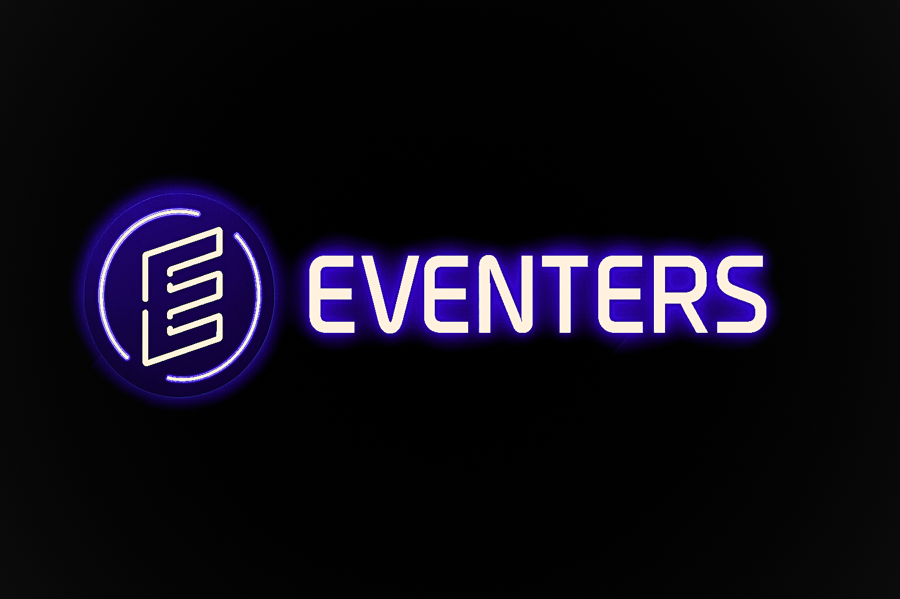

## Overview

🎉 Eventers is a sophisticated Material You Jetpack Compose + Kotlin Android app for managing events—perfect for creating, viewing, registering and tracking upcoming meetups, parties, and workshops.

## Key Features

Create & Edit Events
Add title, description, date/time, location, cover image, category, capacity, and ticket pricing.

Browse & Discover
View upcoming events in a clean, scrollable list or calendar view with category filters and search.

Event Details
Discover detailed info, RSVP, ticket availability, organizer contacts, and share events seamlessly.

Notifications (WIP)
Get reminders before an event starts, with customizable preferences.

Organizer Dashboard (WIP)
View attendee list, edit event info, send updates, or cancel events.

## 🛠️ Built With
- Kotlin & Jetpack Compose – Modern UI toolkit
- ViewModel + LiveData / Flow – MVVM architecture
- Room – Local SQLite database
- Hilt - dependency injection
- WorkManager – Scheduling notifications
- Navigation Component – Screen navigation
- Coil – Image loading
- Material3 – UI theming & components

## 🚀 Getting Started

### Prerequisites

- Android Studio Hedgehog or newer  
- Kotlin 1.9+  
- Android SDK 34+

### Steps

1. Clone this repo:
   ```bash
   git clone https://github.com/Krtonia/Eventers.git
   ```
2. Open in Android Studio
3. Let Gradle sync and resolve dependencies
4. Run on an emulator or real device (API 21+)

## 🧩 Architecture

- MVVM pattern with clean separation of UI, ViewModel, and Repository
- Uses StateFlow / LiveData for reactive updates
- Organized modular code (UI → ViewModels)

## 🤝 Contributing
- Contributions, issues, and feature requests are welcome!

- Fork the repo

- Create your feature branch (git checkout -b feature/new-feature)
- Commit your changes (git commit -m 'Add new feature')
- Push to the branch (git push origin feature/new-feature)
- Open a Pull Request